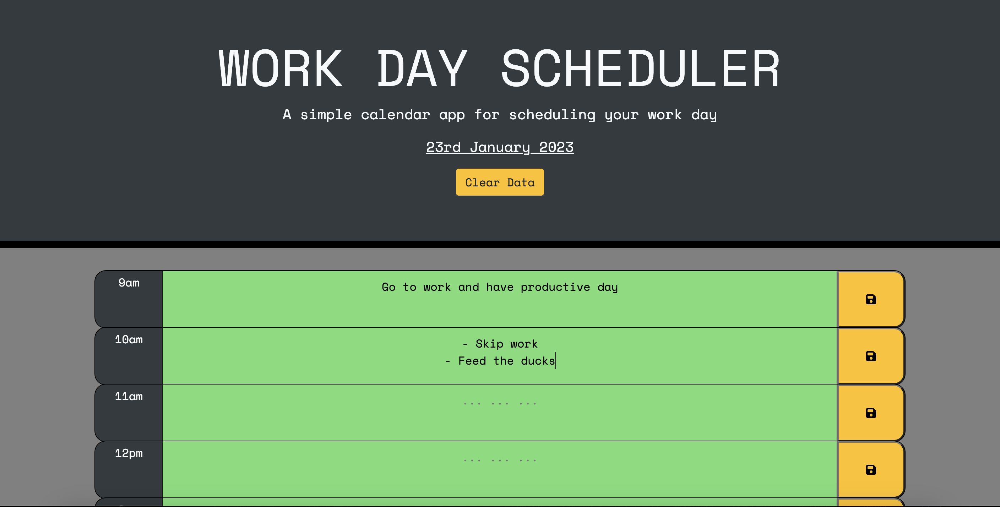

# Daily Planner Application 

## Description 

Link to the Daily Work Schedular: https://cedekpoole.github.io/daily-planner-app/ 

### Technologies Used: 
- HTML
- CSS
- JavaScript
- Bootstrap (v.4.3.1)
- Moment.js
- jQuery (v.3.2.1)

### New Skills Practiced: 

- Bootstrap => This project has provided me with another opportunity to practice with bootstrap, the most popular CSS framework for developing responsive and mobile-first websites (to view the docs, click this link: https://getbootstrap.com/docs/4.3/getting-started/introduction/). Using it endowed me with the ability to develop the aesthetic side of the project with much more ease; it became a very convenient tool in making the page responsive to a variety of viewports. 

- Third-party APIs => APIs provided by third parties allow access to their functionality via JavaScript, giving us the ability to use said functionality on our own sites. As this project relied heavily upon movement around the DOM, jQuery - a lightweight JavaScript library - was used in order to make DOM (Document Object Model) manipulation and transversal easier (read more here: https://api.jquery.com/). As this is an interactive daily planner, another third-party API was used to help manage time more efficiently: Moment.js. It is important to note, however, that while moment.js is no longer supported by its developers, it is still a widely used and functional API (hence usage of it in this project). The main benefits of using this JS library is that it allows us to manipulate and display the date/time simply and directly (link to docs here: https://momentjs.com/docs/#/displaying/). 

The Work Day Schedular amalgamates all the skills discussed above, and the essence of the challenge was to create a functional site that can store and display the user's plan for the day. With this tool, the user can add important events to the planner, giving them the opportunity to manage their time effectively. 

### Acceptance Criteria: 

The app should:

- Display the current day at the top of the calendar when a user opens the planner.

- Present timeblocks for standard business hours when the user scrolls down.

- Color-code each timeblock based on past, present, and future when the timeblock is viewed.

- Allow a user to enter an event when they click a timeblock.

- Save the event in local storage when the save button is clicked in that timeblock.

- Persist events between refreshes of a page.

## Installation 

N/A

## Usage 

If you press on [this link](https://cedekpoole.github.io/daily-planner-app/), you will be redirected to the Work Day Planner application. When the screen loads, the current date can be found in the header of the page. To add events to the daily planner, the user must type in the text area and press the corresponding save button to set the item in local storage. Once set, the items will be saved and displayed even after refreshing the page. 

To remove all existing user inputs, there is a 'Clear data' button within the header that can be clicked. Pressing this button will clear all data stored within local storage. It will also reset the textarea values to an empty string. 

## Roadmap 

In the future, I would like to add more functionality to the page (e.g. be able to flip through future dates and add important events coming up). Any tips on how to achieve this are very welcome!

## Licence 

Please refer to the LICENSE in the repo.